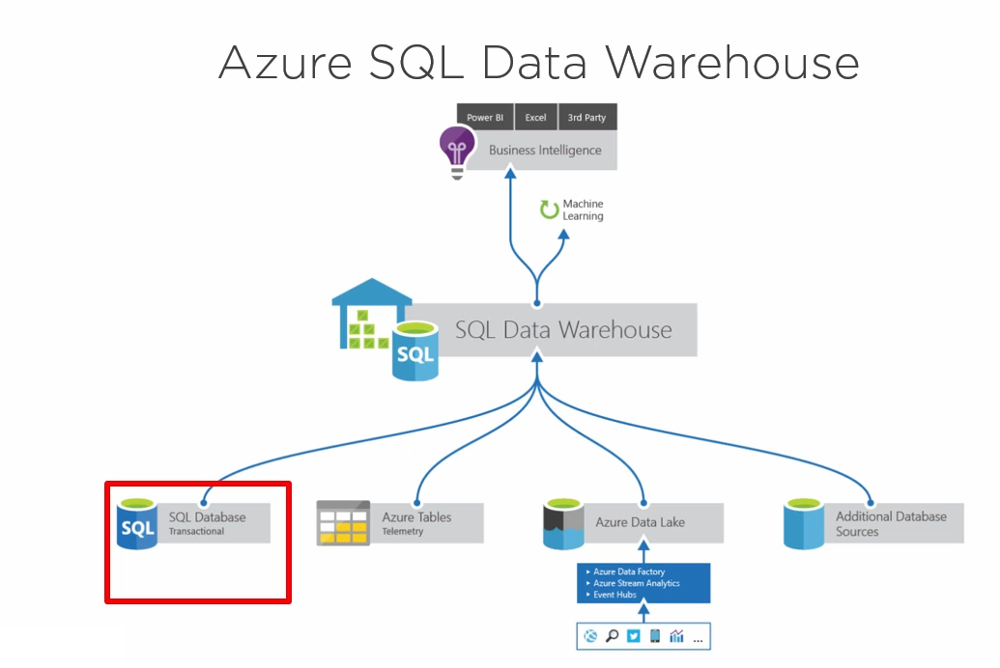

# Azure vs AWS
* [Understanding the Difference Between Microsoft Azure and Amazon AWS](https://app.pluralsight.com/library/courses/understanding-difference-microsoft-azure-amazon-aws/table-of-contents)

## Cloud Platforms
* Elasticity for short-term scaling. Can configure it so once environment hits a certain load a new environment will get spun up/down.
* Vertical(hardware)/Horizontal(instances) long-term scaling
* Pooling
* Service provisioning 

## Cloud Delivery Models
* IaaS - Infrastructure-as-a-service. e.g AWS EC2, Azure Virtual Machines. Target = Sys Admin
* PaaS - Platform-as-a-service. e.g Azure App Service. Target = Developer
* SaaS - Software-as-a-service. e.g Office 365. Target = Customer

## IaaS - Virtual Machine in the cloud
* Gives access to file system and configuration. e.g Registry

### AWS - EC2 = Elastic Compute Cloud
* [EC2 Pricing](https://aws.amazon.com/ec2/pricing/)
* Billed per hour
* Linux/Windows 
* Files stored in Azure Blob Storage
* 'On-Demand' most common

### Azure - Azure VM
* [Azure VM Pricing](https://azure.microsoft.com/en-gb/pricing/calculator/?service=virtual-machines)
* Billed per minute
* Linux/Windows
* Files stored in EBS (Elastic Block Storage)


## PaaS - Application Hosting

### AWS - Elastic Beanstalk
* [AWS Free Tier](https://aws.amazon.com/free/) - Elastic Beanstalk
* https://aws.amazon.com/visualstudio/


### Azure - Azure App Service
* https://azure.microsoft.com/en-gb/tools/
* [Azure Pricing](https://azure.microsoft.com/en-gb/pricing/details/app-service/windows/) - Azure App Service


## Storage

### Azure
1. On Azure create a Storage Account (Blob, Disk/File, Table Storage + Cosmos (NoSql), Queue) 
2. Calculate cost https://azure.microsoft.com/en-us/pricing/calculator/
3. Start Windows Azure Storage Emulator
4. To use the development azure storage use the following connection string
```
"UseDevelopmentStorage=true";
```

### Azure Storage Tools
* [Data Migration Assistant](https://www.microsoft.com/en-us/download/confirmation.aspx?id=53595)
* [Microsoft Azure Table Storage Explorer](https://azure.microsoft.com/en-us/features/storage-explorer/)
* [CloudBerry Explorer](https://www.cloudberrylab.com/download.aspx?prod=cbazure)

### AWS
* [S3 = Blob Storage](https://aws.amazon.com/s3/pricing/)
* EBS = Block Storage for VM's

### AWS Storage Tools
* [S3 Browser](http://s3browser.com/)
* [CloudBerry Explorer](https://www.cloudberrylab.com/download.aspx?prod=cbes3free)
* [AWS Powershell Tools](https://aws.amazon.com/powershell/)

## Relationl Databases

### Azure
* Azure SQL Database

### AWS 
* [AWS RDS](https://us-east-2.console.aws.amazon.com/rds/home)

## NoSQL Databases

### Azure
* [Table Storage](https://azure.microsoft.com/en-gb/services/storage/tables/)
* [Cosmos](https://docs.microsoft.com/en-us/azure/cosmos-db/introduction)
* [Cosmos Playground](https://www.documentdb.com/sql/demo)

### AWS 
* [SimpleDB](https://aws.amazon.com/simpledb/)
* [DynamoDB](https://aws.amazon.com/dynamodb/)

## In-memory Caching

### Azure
* [Redis](https://azure.microsoft.com/en-gb/services/cache/)

### AWS
* [ElastiCache](https://aws.amazon.com/elasticache/)

## Data Warehouse (Big Data)


### Azure


## Security
* Key vaults allow you to manage credentials and programatically get the credentials without exposing plain text password.

### Azure
* [Key Vault](https://azure.microsoft.com/en-gb/pricing/details/key-vault/)
* [Multi-Factor Authentication](https://azure.microsoft.com/en-gb/pricing/details/multi-factor-authentication/)

### AWS
* [Key Management Services](https://aws.amazon.com/kms/)
* [Multi-Factor Authentication](https://aws.amazon.com/iam/details/mfa/)